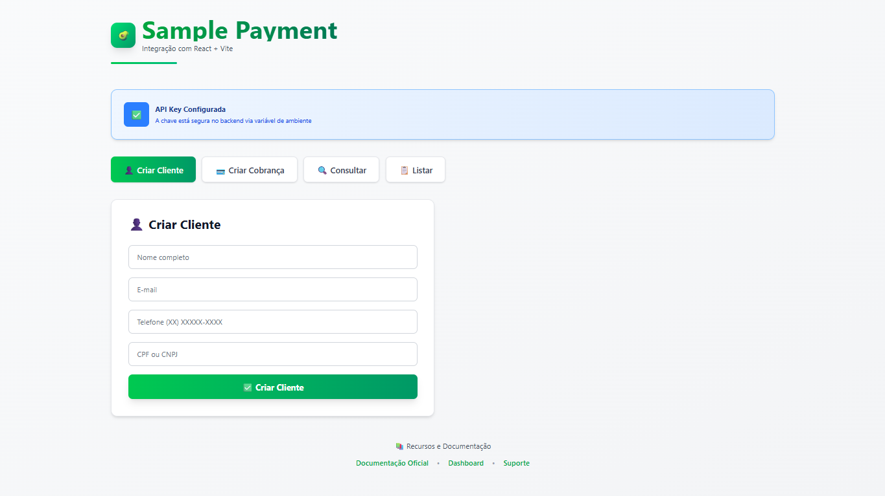

# AbacatePay Integration Sample



Este é um projeto de exemplo que demonstra a integração com a API do AbacatePay usando React e Vite. O projeto inclui funcionalidades para criar clientes, gerenciar cobranças e consultar transações.

## 🚀 Funcionalidades

- ✅ Criação de clientes
- 💳 Geração de cobranças PIX
- 🔍 Consulta de cobranças
- 📋 Listagem de transações
- 📱 Interface responsiva
- 🎨 Design moderno com Tailwind CSS

## 🛠️ Tecnologias

- [React](https://reactjs.org/)
- [Vite](https://vitejs.dev/)
- [Tailwind CSS](https://tailwindcss.com/)
- [Lucide React](https://lucide.dev/) (para ícones)

## 📋 Pré-requisitos

- Node.js (versão 14 ou superior)
- NPM ou Yarn
- Conta no AbacatePay com acesso à API

## ⚙️ Configuração

1. Clone o repositório:
```bash
git clone https://github.com/vitorluzz/sample-payment.git
cd sample-payment
```

2. Instale as dependências:
```bash
npm install
# ou
yarn
```

3. Configure as variáveis de ambiente:
   - Crie um arquivo `.env` na raiz do projeto
   - Adicione sua chave API do AbacatePay:
```env
VITE_ABACATE_API_KEY=sua_chave_api_aqui
```

## 🚀 Executando o projeto

1. Inicie o servidor de desenvolvimento:
```bash
npm run dev
# ou
yarn dev
```

2. Acesse `http://localhost:5175` no seu navegador

## 💡 Uso

### Criando um Cliente

1. Acesse a aba "Criar Cliente"
2. Preencha os campos:
   - Nome completo
   - E-mail
   - Telefone
   - CPF/CNPJ
3. Clique em "Criar Cliente"

### Gerando uma Cobrança

1. Acesse a aba "Criar Cobrança"
2. Preencha os detalhes do produto:
   - Nome
   - Descrição
   - Preço
   - Quantidade
   - ID do cliente (opcional)
3. Clique em "Criar Cobrança"

### Consultando Cobranças

1. Acesse a aba "Consultar"
2. Insira o ID da cobrança
3. Clique em "Consultar"

### Listando Transações

1. Acesse a aba "Listar"
2. Clique em "Listar Cobranças"

## 🔒 Segurança

- As chaves de API são armazenadas em variáveis de ambiente
- As requisições são feitas através de um proxy seguro
- Todas as comunicações são feitas via HTTPS

## 🤝 Contribuindo

1. Faça um fork do projeto
2. Crie uma branch para sua feature (`git checkout -b feature/AmazingFeature`)
3. Commit suas mudanças (`git commit -m 'Add some AmazingFeature'`)
4. Push para a branch (`git push origin feature/AmazingFeature`)
5. Abra um Pull Request

## 📝 Licença

Este projeto está sob a licença MIT. Veja o arquivo [LICENSE](LICENSE) para mais detalhes.

## 📬 Contato

Para suporte ou dúvidas sobre a integração, entre em contato:
- Email: contato@abacatepay.com
- Site: [AbacatePay](https://abacatepay.com)
- Documentação: [Docs](https://docs.abacatepay.com)

---

Desenvolvido com 🥑 por [AbacatePay](https://abacatepay.com)